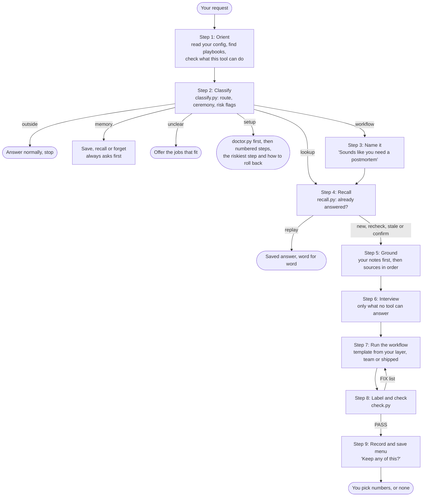

# How it works

Every request runs through the same nine steps, and a lookup table decides how much of each step it gets.

## The idea

Most people type one vague line. flarehand does the thinking up front. It names the artifact you need, asks only the questions that change it, and grounds every specific in a source. Then it checks the draft with scripts and offers to keep what was worth keeping.

**The facts stay the same for everyone. The shape follows the person.** Two people asking the same thing get the same facts, shaped by their role, their team's playbook and their preferences.

## The nine steps

The chart shows the full path for a workflow. A lookup runs only steps 4, 5 and 7: recall, ground, and answer with a citation. A lookup that took a search still ends with the save menu.

| Step | What happens | What you see |
|---|---|---|
| 1. Orient | Reads your `config.json` and `index.md`. Once a session, runs `doctor.py --capabilities` to learn what this tool can do: shell, web, git, MCP servers, subagents. Looks for a team playbook. Checks whether a note or a check-in is due. | Usually nothing. At most one line when something is due. |
| 2. Classify | Runs `classify.py` on your exact words. It is a table lookup, so the same words always give the same route. | Nothing, unless it needs to ask one question first, such as which meaning of a word in your glossary. |
| 3. Name it | Says what you need, in your words, before any work. | "Sounds like you need a postmortem. Say 'just go' and I will assume X, Y and Z." |
| 4. Recall | Runs `recall.py` to see whether you saved an answer to this question. | A replay, word for word, or a question if a saved one only looks similar. |
| 5. Ground | Searches your knowledge base first, then the sources `sources.py order` names for your roles and this question. Quotes go into a ledger. | Notes say when they were last checked. |
| 6. Interview | Asks only what no tool could answer, each question with a recommended answer. Skips the interview when your message already holds the facts. | Numbered questions, or none. |
| 7. Run the workflow | Opens the workflow method and the template that wins for you. Applies house rules from every layer. | The artifact, at the top of the reply. |
| 8. Label and check | Labels every claim, then runs `check.py`. Fixes what it names and runs it again until it prints `PASS`. | Labels on specifics. A finding only when you must decide something. |
| 9. Record | Records which sources helped, notices patterns, and shows the save menu. | "Keep any of this?" and a numbered list. |

On a first run, step 9's menu is replaced by the optional setup block. See [Getting started](getting-started.md#3-the-optional-setup-block).

## The routes

Step 2 picks one route.

| Route | When | What it does |
|---|---|---|
| `outside` | General coding or personal writing with no work deliverable. "My React effect runs in a loop." A cover letter. | Answers normally and stops. |
| `lookup` | One fact or definition. "What is hypercare?" | Grounds it and answers with a citation. No interview. |
| `setup` | Install, connect or fix access for a tool, or set up this plugin. "Codex can't see the MCP server." | Runs `doctor.py` first, then gives numbered steps, the riskiest step, and how to roll back. |
| `workflow` | Produce an artifact. | Every step. |
| `memory` | Save, log, recall, forget, glossary or house rule. | Names the kind of save back to you and waits for a yes. |
| `unclear` | Nothing matched. "The migration." | Offers the three or four jobs that fit your work, in your words. |

A ticket key does not make a request work for flarehand. "For TICKET-123, refactor this" is still general coding. Naming a tool does not either: "write a python script that reads the Jira API" is general coding.

`setup` means tool setup only. "Billing module setup" is configuring your work, so it is a workflow.

## Ceremony and the question cap

`classify.py` also returns a ceremony level. It is the one source of truth for how many questions to ask, so two sessions never disagree.

| Ceremony | When | How much it asks |
|---|---|---|
| `light` | Lookups, setup, memory, outside | Nothing, unless it is blocked |
| `standard` | A workflow for you or your team | At most three questions, each with a recommended answer |
| `full` | A customer, an executive, engineering or an auditor reads it, or a risk flag fired | At most four questions a round, round after round |

A few more rules hold the cap honest:

- **The cap counts everything.** A template's own `learn` questions count toward it. When there are more candidates than the cap, it keeps the ones that change the artifact most and states its assumption for the rest.
- **Facts first, questions after.** Your message may already hold the facts, such as notes to write up or a draft to tidy. Then it writes the artifact first and asks after.
- **Look before asking.** Finding facts is its job, never yours. It checks your notes, your files, git history and connected sources before it asks.
- **"Just go" always works.** It takes every recommended answer and labels each one `[ASSUMPTION, verify]`.
- **`adaptation: yours`** lets a `standard` request skip one optional question. A `full` request never skips one.

### Risk flags

A risk flag adds a guardrail for the whole task. Seven of them also raise the ceremony to `full`: `stated-cause`, `outbound-gate`, `legal-advice`, `financial-figures`, `people-matter`, `security-claim` and `production-write`. `check-before-send` turns a lookup or an unclear request into a workflow.

| Flag | Guardrail |
|---|---|
| `stated-cause` | The reporter's theory stays `[stated, unverified]` everywhere, including a customer reply. |
| `outbound-gate` | `redact.py` runs before anything leaves, and you decide. |
| `legal-advice` | Summarise and compare only. No conclusion, no liability call. |
| `financial-figures` | Never computes or invents a figure. Shows the arithmetic and who verifies it. |
| `people-matter` | Draft only, flag bias risk, route to HR. |
| `people-notes` | Dated work facts first. Patterns and opinions stay labelled. No health or reasons for absence. |
| `security-claim` | Answers only from evidence supplied, and marks every unsupported claim. |
| `production-write` | Read only, unless you asked for the change in plain words this session. |
| `check-before-send` | You want a draft checked before it goes out. It runs `check.py --outbound` first. |
| `credentials` | Never repeats a secret back or pastes one into a draft. |
| `customer-identifiers` | Handles them carefully, per the privacy rules. |

## The twelve workflows

Each workflow is a method in its own file. It holds the traps to avoid, the intake questions, the procedure, the output shape and the exit checks.

| Id | Workflow | Use it when | For example |
|---|---|---|---|
| wf-01 | Diagnose without anchoring | Something is broken and you want to know why | "Exports fail since the upgrade, the customer thinks it is the firewall" |
| wf-02 | Close the information gap | You need to know what to ask someone else | "What should I ask Acme before we scope this?" |
| wf-03 | Package for the receiving team | Handing work to another team so it is not bounced | "Escalate this to engineering", in SBAR form by default |
| wf-04 | Compress for an audience that was not there | Making something long short, for one reader | "Summarise this thread for the VP" |
| wf-05 | Draft the standard artifact | Producing what your role ships, from the template catalog | "Write a postmortem", "Draft release notes" |
| wf-06 | Translate across an expertise boundary | Explaining something written for a different audience | "Explain this SQL in plain English" |
| wf-07 | Diff and reconcile | Two things should match and do not | "Why doesn't actual tie out to budget?" |
| wf-08 | Find themes across many items | Many items, and you want the pattern | "Top issues across these 200 tickets" |
| wf-09 | Break work into an ordered plan | Turning a goal into steps someone can run | "Plan the cutover", "Write a runbook" |
| wf-10 | Adversarial review | Poking holes before someone else does | "Poke holes in this plan", "Review this PR" |
| wf-11 | List a full coverage set | Listing every item exhaustively, not by search | "Every edge case for the export", "a risk register" |
| wf-12 | Re-tone for a different reader | Same facts, different tone | "Make this reply less blunt" |

Workflows chain. A diagnosis often leads to a package for another team, then a customer reply. The save menu's "Next" line offers the usual next one.

You can also make a workflow of your own from steps you repeat. See [Memory and learning](memory-and-learning.md#from-a-chain-to-a-workflow).

## The four entry points

Four smaller skills hand over to `flarehand` with a fixed route, so the work starts at once and all five share one set of rules.

| Entry point | Use it to | Say things like |
|---|---|---|
| `flarehand-ground` | Check a draft, its facts or numbers, before it goes out | "Check this before I send it", "are the numbers right" |
| `flarehand-review` | Review code, a PR, a diff, a document or a plan, graded lens by lens | "Review my PR", "is this ready to ship" |
| `flarehand-remember` | Save, recall or forget your own notes and answers | "Remember this", "what did we decide about X", "forget that" |
| `flarehand-grill` | Stress-test a plan or a vague ask with sharp questions before any work | "Grill me", "poke holes in this", "ask me questions first" |

Each entry point needs `flarehand` installed beside it. Install all five together.

`flarehand-grill` asks every open question in one round, each with a recommended answer, and ends with a short brief of decisions, assumptions and open questions. Its interview style follows `grill-me` by Matt Pocock, MIT licensed, at https://github.com/mattpocock/skills.

`flarehand-review` uses seven lenses: correctness, regressions, completeness, code quality, references and docs, dynamic or hardcoded, and perspectives. A second pass that did not find a finding checks it against the code. `review.py grade` grades each lens `pass`, `concerns` or `fail` by a fixed rule.

## Why scripts and tables

A hosted language model cannot be made to produce identical text twice. Thinking Machines Lab measured this in "Defeating Nondeterminism in LLM Inference", September 2025: one model at temperature zero, a thousand runs, eighty different completions. So flarehand moves every decision that should never vary out of the model and into a table or a script:

- **Routing** lives in `assets/router-table.tsv`. The same words give the same route forever.
- **Source order** comes from `sources.py order`, which combines the question, your project, your roles, your pins and your usage the same way every time.
- **Style, redaction and output shape** live in tables and are checked by scripts.
- **"Good enough" is a check a machine runs.** The quote is in the snapshot or it is not. Its numbers match the claim or they do not.
- **Saved answers replay as a file read**, not a new generation. So the words match exactly, in any session or tool on that machine.

A saved answer replays only when the question matches a wording you already confirmed. The match ignores only case, punctuation and spelling variants. A question that merely looks similar is shown to you first, with the words that differ, and never replayed on a guess. A missed repeat costs one extra answer. A false replay costs a wrong answer delivered with confidence. The design always picks the first.

**What stays the same, and for whom.** The same person asking again gets the same answer, from their saved answers. Two different people get the same method and the same facts, but may cite different sources, because the source order follows each person's role. That is intended: a controller and a developer asking about the same posting rule need the same rule, explained two ways.

Every script-backed step also has a written way to do it by hand, for tools with no shell. A script is never the only path.

Next: [Grounding](grounding.md)
